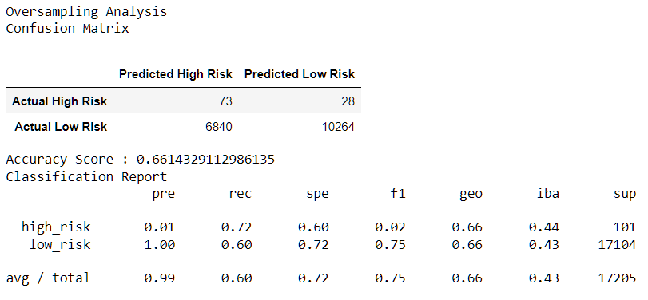
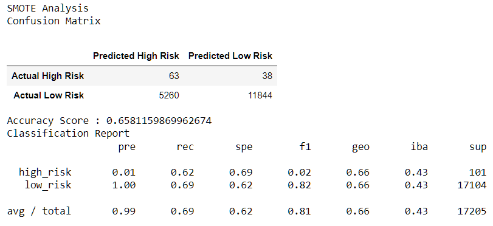
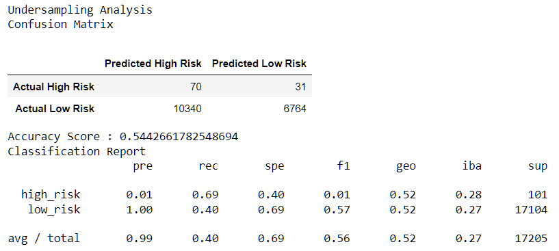
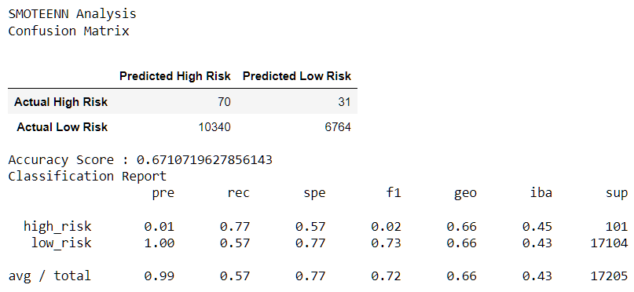
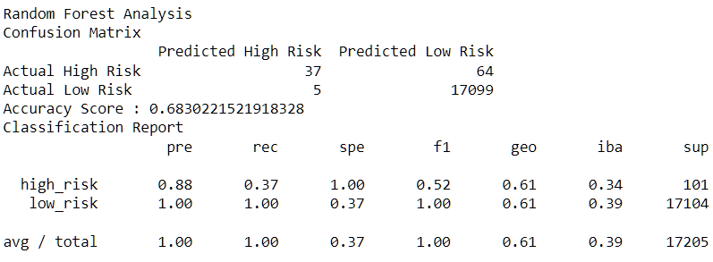
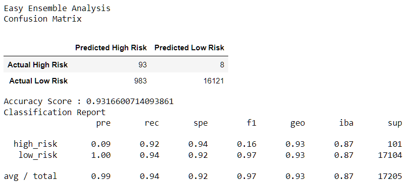

# Credit Risk Analysis

## Overview
The purpose of the analysis is to find a predictive model that balances precision and sensitivity (recall) in the data, and thereby reduces the chance of predicting too many high or low risk results in the analysis.

The credit risk analysis examines data from LendingClub, a peer-to-peer lending service company. Credit risk is an unbalanced classification problem, because good loans easily outnumber risky loans. Therefore, the research department has been tasked with employing different machine learning techniques to train and evaluate models using resaampling.

This analysis will use the LoanStats_2019Q1.csv dataset, and imbalanced-learn and scikit-learn libraries to perform the analysis. The following models will be used in the analysis:
* Naive Random Oversampling
* SMOTE Oversampling
* Cluster Centroid Undersampling
* SMOTEENN Sampling
* Balanced Random Forest Classifying
* Easy Ensemble Classifying

## Results
For each model, a summative report shows the accuracy score, confusion matrix and classification report displayed below. These scores are key indicators to determine a balance between precision and sensitivity that will help eliminate results that identify low risk credit results as high risk, and visa versa. 

### Naive Random OverSampling
* Accuracy score: 66%
* Precision (High risk): 1%
* Precision (Low risk): 100%
* Recall (High risk): 72%
* Recall (low risk): 60%

### SMOTE Oversampling
* Accuracy score: 66%
* Precision (High risk): 1%
* Precision (Low risk): 100%
* Recall (High risk): 62%
* Recall (low risk): 69%

### ClusterCentroid Undersampling
* Accuracy score: 54%
* Precision (High risk): 1%
* Precision (Low risk): 100%
* Recall (High risk): 69%
* Recall (low risk): 40%

### SMOTEEN Sampling
* Accuracy score: 67%
* Precision (High risk): 1%
* Precision (Low risk): 100%
* Recall (High risk): 77%
* Recall (low risk): 57%

### Balanced Random Forest Classifying
* Accuracy score: 68%
* Precision (High risk): 88%
* Precision (Low risk): 100%
* Recall (High risk): 37%
* Recall (low risk): 100%

### Easy Ensemble Classifying
* Accuracy score: 93%
* Precision (High risk): 9%
* Precision (Low risk): 100%
* Recall (High risk): 92%
* Recall (low risk): 94%

## Summary
First we look at the accuracy scores to determine the percent of true positives plus true negatives divided by all observations. Accuracy scores help narrow down our analysis by eliminating those observations that are returning too many false returns. In the case of the credit risk analysis, what percent of high and low risk observations are identified and are actually true. Accuracy in descending order:
* Easy Ensemble Classifying - 93%
* Balanced Random Forest Classifying - 68%
* SMOTEEN Sampling - 67%
* Both Random and SMOTE oversampling - 66%
* Cluster Centroid undersampling - 54%

Second we look at the precision of the data model. Precision shows the total number of true positives divided by the total true and false positive results. 

